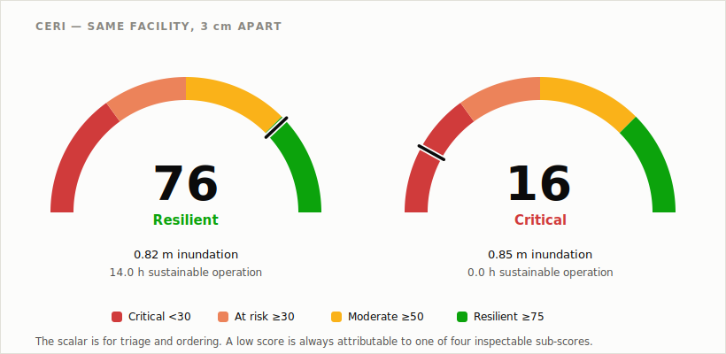

# ResilienceScout

### Decision intelligence for climate-resilient critical infrastructure

**When climate hazards disable a critical facility, which single intervention restores the most
function per hour of work — and can we answer that before anyone walks into the building?**

[]()
[]()
[](LICENSE)

ResilienceScout is an AI-powered decision-support platform for the operational readiness of
critical public infrastructure — hospitals, schools, emergency shelters, water and power facilities, government
buildings and campuses — under climate hazard.

**At its core:** you describe a facility's energy system once — what powers what, and at what height
each piece of equipment sits. Given a hazard level, the platform works out whether the facility
can still run, for how many hours, and which single repair brings it back fastest. It is built on
a dependency graph of the facility, a physics-based model of its load, and an explicit account of
what has been measured versus assumed.

---

## Why ResilienceScout is different

Most post-hazard tooling answers *what is damaged*. That is a detection question, and it is well
served. ResilienceScout answers *what the damage means*, which is a different computation and
requires a model of how a facility's subsystems depend on one another.

Concretely, given a set of failures it determines:

- **What still works** — whether the facility can deliver its critical function right now, judged
  against whether surviving resources can carry the critical load, not against whether a wire is
  still connected.
- **What fails next** — which undamaged components are single points of failure, and which
  constraints bound how long current operation can be sustained.
- **Which intervention restores the most operational value** — the smallest repair set that
  returns the facility to service, and what deferring everything else costs.

A component-level damage report structurally cannot produce any of the three, because each is a
question about topology and constraint rather than condition.

---

## The problem

Climate hazards disable critical facilities primarily through their energy infrastructure. A
hospital with a flooded switchgear room, a school with an inundated generator, a pumping station
that lost its transformer — in each case the building is structurally sound and operationally
dead.

**Assessment today is an inventory exercise.** Trained personnel walk the site and record what
looks damaged. That is slow, hazardous during an active event, and produces the wrong artefact: a
list of broken components, when the decision-maker needs an ordering over interventions.

**The tooling gap follows from this.** Considerable research and commercial effort addresses
damage *detection* — identifying failures from imagery and sensors. Far less addresses damage
*consequence*: given what has failed, is the facility still operational, and what is the cheapest
path back.

---

## Core contributions

The individual ingredients are established engineering. Dependency and fault-graph modelling of
infrastructure is mature, restoration scheduling is a known operations-research problem, and
reduced-order building physics is standardised. What is assembled here is a **facility-scale
consequence reasoning platform** that combines four of them — dependency-graph topology,
hazard-aware energy adequacy, uncertainty-aware assessment, and repair prioritisation — at a
resolution most of that work does not operate at. Network- and regional-scale models typically
treat a facility as a single node; this model works inside it, which is where repair decisions
are actually made.

### 1. Infrastructure Dependency Graph

Energy infrastructure is modelled as a directed dependency graph, and hazard is propagated
through it rather than evaluated per asset.

<p align="center">
  
</p>

This exposes failure semantics invisible to any per-asset checklist:

- Losing the **transformer** is survivable with charged storage, and fatal without it. The same
  component failure has opposite consequences depending on system state.
- Losing the **distribution panel** is fatal regardless of what survives, because every source is
  wired through it. It is a single point of failure *even when undamaged and dry* — a property of
  topology, not of condition.
- Losing **road access** costs no power immediately but severs fuel resupply, bounding how long
  generation can be sustained. Consequence is delayed, and only visible through the graph.

Single-point-of-failure detection follows directly from the structure (disjunction across
redundant sources, conjunction through shared infrastructure).

### 2. Recovery Prioritization

Given a set of failures, the system searches exhaustively for the **minimum repair set** that
restores operation, then orders candidate sets by **population served per repair-hour**.

The objective function is deliberately service-oriented rather than damage-oriented. The most
expensive repair is frequently worth nothing, and the search says so explicitly by reporting what
it chose to defer and what deferring it saved.

Critically, restoration is evaluated on **adequacy, not connectivity**. Asking "is a path still
connected?" yields the wrong answer: under deep inundation a roof-mounted inverter survives, so
the graph reports the facility as powered while the energy model reports zero hours of sustainable
operation. Restoration is judged against whether the facility can carry its critical load for a
required window.

**On exhaustive search.** Enumerating subsets of failed assets is exponential, and that is an
acceptable and deliberate trade at facility scale: a single facility models under ten energy
assets, so the search is cheap. It returns a plan that is provably minimum-effort for the modelled
graph, rather than a greedy approximation that is occasionally wrong. It does not extend as-is to
district scale, where the problem takes on set-cover structure and will require approximation
methods. That is future work, and is why multi-site ranking is listed below as
architecture-supports rather than demonstrated.

### 3. Climate Energy Readiness Index (CERI)

An engineering instrument rather than a summary score. Three properties make it decision-usable:

**Decomposable.** The 0–100 value is a weighted combination of four independently inspectable
sub-scores, so a low score is always attributable to a specific deficiency rather than an opaque
judgement. Consumers are expected to read the sub-scores; the scalar is for triage and ordering.

| Sub-score | Weight | Measures |
|---|---|---|
| Energy readiness | 0.30 | Surviving generation and storage vs critical load × required window |
| Flood readiness | 0.25 | Elevation margin of the weakest power asset above the hazard line |
| Backup duration | 0.30 | Surviving ride-through vs the required operating window |
| Critical vulnerabilities | 0.15 | Single points of failure in the dependency graph |

These weights, and the reporting bands below, are **engineering baseline values** — not elicited
from practitioners or fitted to outcome data. Calibration through expert feedback and field
validation is specified in the [evaluation plan](docs/evaluation.md); until then CERI is best read diagnostically, through its
sub-scores, rather than compared across facilities.

**Hazard-responsive.** Sub-scores read the *post-hazard* resource set, not the nameplate
inventory. A readiness metric that returns the same value at every hazard intensity is not
measuring readiness against that hazard.

**Uncertainty-aware.** Where measurement error is comparable to the decision margin, the model
reports the asset as *at risk* rather than resolving to a state it cannot justify. See below.

Bands: **≥75** Resilient · **≥50** Moderate · **≥30** At risk · below that, Critical.

<p align="center">
  
</p>

### 4. Uncertainty-aware reasoning

Where a quantity cannot be measured, the system **prices its absence** rather than assuming a
value. The dependency graph is evaluated under both extremes — asset survives, asset fails — and
the model reports whether the facility's outcome actually depends on the gap.

This is interval bounding rather than probabilistic uncertainty quantification: it yields a best
and worst case, not a distribution. That is deliberate at this stage — assigning failure
probabilities to assets requires fragility data this project does not have, and inventing priors
would manufacture the false confidence the method exists to prevent. Where the two extremes agree,
the missing measurement does not need funding; where they diverge, it is decision-relevant and the
system says so.

It also prevents the common failure mode in which an unmodelled asset is silently treated as
intact, biasing every result toward optimism. Interval bounds do widen as unmeasured assets
accumulate; characterising where they stop discriminating is an
[evaluation task](docs/evaluation.md).

---

## Evidence: decision margins below measurement resolution

At the prototype reference site, operational readiness collapses across a **three-centimetre**
band of hazard intensity.

| Inundation depth | CERI | Sustainable operation | State |
|---|---|---|---|
| 0.82 m | **76** Resilient | 14.0 h | Generation intact, load carried |
| 0.85 m | **16** Critical | 0.0 h | Generation lost, no backup capacity |

The generator alternator sits at **0.85 m** above finished floor level. The observed 2018
high-water mark at this facility is **0.82 m**.

<p align="center">
  
</p>

That 3 cm margin is **narrower than the survey's own uncertainty** (±6 cm at 2σ). The system
therefore reports the asset as *at risk* rather than asserting a state it cannot justify — it
cannot honestly determine whether this generator was inundated in 2018.

Three things make this result significant beyond the single site:

1. **The margin is physical; the sharpness of the transition is modelled.** The 3 cm gap falls out
   of two independent measurements — surveyed alternator elevation and observed high-water mark —
   and is not a modelling choice. The abruptness of the CERI response across it is: assets
   currently carry a binary survive/fail threshold at their elevation, where real inundation
   damage is probabilistic. Replacing thresholds with fragility functions would soften the
   transition without moving the margin, because the margin is a measurement.
2. **It is actionable and cheap.** Raising one equipment plinth by 30 cm moves the facility across
   the entire band — an intervention no damage report would ever surface, because the finding is
   about a *margin between assets*, not about any asset's condition.
3. **It is likely to generalise, though a single site cannot establish prevalence.** Critical
   facilities are routinely commissioned without recording equipment elevations to the precision
   at which their resilience is actually determined. Where the decision margin is smaller than the
   measurement resolution, an assessment that reports a confident binary state is reporting noise.

The interactive dashboard allows an assessor to move the hazard level continuously across this
threshold and observe every downstream metric respond.

---

## System architecture

The platform separates **hazard modelling**, **consequence reasoning**, and **sensing**, so each
can evolve independently. Consequence reasoning is the core; sensing and hazard are pluggable
inputs.

<p align="center">
  
</p>

**Design rationale.** The reasoning core was implemented first, deliberately. An inspection system
without a consequence model produces imagery; a consequence model with a defined ingestion
contract produces decisions from whatever sensing is available — today a tape measure and public
weather, tomorrow autonomous inspection — without redesign. The ingestion endpoint validates
vertical datum on every reading and rejects any measurement it cannot convert, so sensing
modalities can be added without corrupting the elevation model everything else depends on.

**Why the digital twin exists.** Adequacy is a load question, and load is not a constant. The
5R1C thermal model supplies what the energy model needs to answer *for how long* — indoor
conditions driving cooling demand, and generation capacity under actual weather — rather than
assuming a fixed nameplate draw. Without it, sustainable-hours estimates would be a division
problem with an invented numerator.

**Why robotics exists, and why it is subordinate.** ResilienceScout is not a robotics project;
the robot is one sensing modality behind the ingestion contract, and the reasoning core does not
depend on it existing. It addresses a specific bottleneck: the binding constraint on deployment
is not computation but the elevation survey described above, which most facilities have never had
done to the precision their resilience turns on. That is the cold-start cost gating every new
site.

Fixed instrumentation cannot solve it. Sensors report state at points already known and
instrumented, whereas the gap is *establishing* the elevation model across assets nobody has
measured — in cramped plant rooms, and during events when those spaces are unsafe to enter.
Robotic inspection targets that acquisition problem. Fixed sensors, described under Future
direction, are the better fit for continuously monitoring assets already characterised. The two
are complementary.

---

## Implementation status

Stated explicitly, because a reader should not have to infer it.

| Component | Status |
|---|---|
| Dependency graph, SPOF detection, sensitivity analysis | Implemented, tested |
| Recovery prioritization and minimum-repair-set search | Implemented, tested |
| CERI scoring, four sub-scores | Implemented, tested; weights uncalibrated |
| Physics-informed digital twin (5R1C ISO-13790) | Implemented; runs on live weather forcing, not yet evaluated against measured indoor conditions |
| Flood hazard propagation, datum enforcement | Implemented, tested |
| Energy model (generation → storage → solar sequencing) | Implemented, tested |
| Retrofit comparison and budget optimisation | Implemented, tested |
| REST API, analyst dashboard, grounded copilot | Implemented |
| Telemetry ingestion contract | Implemented; exercised end to end |
| Population-served and repair-effort data | Placeholder values — see Data provenance |
| Robotic inspection platform (RGB, thermal, water-level, SLAM) | In development |
| Computer-vision damage classification | In development |
| Terrain-derived hazard return periods | Requires LiDAR/photogrammetry acquisition |
| Multi-site deployment across shared upstream infrastructure | Architecture supports; awaiting second surveyed site |

The reasoning platform is covered by 80 regression tests spanning graph topology and SPOF
detection, minimum-repair-set optimality, CERI sub-score response across hazard intensity, datum
conversion and rejection of unconvertible readings, and provenance invariants — including an
assertion that no claimed population exceeds the floor-area bound, so a stale data claim fails the
build rather than passing quietly. It runs fully offline with no API keys. The sensing layer is
specified with its ingestion interface implemented and exercised; the hardware is under
development.

---

## Data provenance

Decision support is only as trustworthy as its weakest input, and the usual failure is that
measured values and guesses become indistinguishable once they are both numbers on a dashboard.
Every input here therefore carries a provenance tier, enforced in code rather than noted in
comments.

| Tier | Meaning | Examples at the reference site |
|---|---|---|
| **SOURCED** | Measured directly on site | Vertical datum tied to MSL, 2018 high-water mark, six of eight equipment elevations, full distributed-energy nameplate |
| **DERIVED** | Computed from a surveyed input plus a named published standard, so a reader can recheck the arithmetic and challenge the citation | Shelter capacity upper bound, from gross floor area and a published minimum area per person |
| **REPORTED** | Stated by site staff or institutional records, not independently verified | Substation sits above flood level; reported critical load |
| **PLACEHOLDER** | An estimate or a default, carrying an open action | Population served; repair-effort hours |

Two consequences a reader should carry into the rest of this document.

**The recovery ranking's objective function currently rests on placeholder inputs at both ends.**
Population served and repair effort are not surveyed at this site. The ranking therefore
demonstrates a method rather than issuing advice, and results are flagged as such through the API
and the dashboard.

**The registry is load-bearing, not decorative.** Unsurveyed values drive a dashboard notice, and
cross-checks are asserted in the test suite — so a population claim exceeding what the floor area
can physically hold fails the build. Where two survey records disagree, as the reported and
itemised critical load currently do, both are retained as a range rather than averaged. The
direction of that discrepancy affects sustainable-hours estimates.

---

## Technology

| Layer | Technology |
|---|---|
| Hazard inputs | Open-Meteo forecast and reanalysis (keyless) |
| Building physics | `rcbsim` — 5R1C ISO-13790 (ETH Zürich, MIT) |
| Numerics | NumPy, pandas |
| Service layer | FastAPI, Uvicorn, Pydantic |
| Natural-language interface | ChromaDB retrieval → TF-IDF fallback, Groq LLM (optional) |
| Analyst dashboard | React 18, TypeScript, Vite, Tailwind, Radix, Recharts |
| Verification | pytest — 80 regression tests |

---

## How it works

```
1. INPUT      Facility parameters + hazard data (public APIs, survey, or telemetry)
                        │
2. SIMULATE   5R1C thermal twin → indoor conditions, generation capacity
                        │
3. PROPAGATE  Per-asset exposure: surveyed elevation vs hazard intensity
                        │
4. REASON     Which surviving resources still reach the load
              → single points of failure, cascade sets
                        │
5. QUANTIFY   Generation → storage → solar, against critical load
              → sustainable hours of operation
                        │
6. SCORE      CERI across four inspectable sub-scores
                        │
7. PRIORITIZE Minimum repair set restoring operation,
              ordered by service restored per repair-hour
                        │
8. DELIVER    REST API · dashboard · natural-language interface
```

**Worked example — reference site under 1.2 m inundation.**

> **Read the repair-hour figures as illustrative, not as findings.** The repair durations below
> are placeholder estimates, not surveyed values, and the same is true of the population figures
> the ranking uses. What is exact is the *search*: which set is minimal, and which failures are
> off the critical path. Those conclusions follow from the topology and the energy model. The
> hour counts attached to them do not yet come from this site.

Failed: transformer, battery, generator, road access. A damage report terminates here: four
failures, and a remediation total that is their sum.

The graph continues. The solar inverter survives but cannot carry critical load independently, so
the facility is **not operational**. Of the four failures, only one is on the critical path to
restoring adequate power.

> **Minimum repair set: {generator} — 12 hours.** No smaller set restores adequate power.
> Defer battery (10 h), road access (8 h), transformer (48 h).
> **12 hours of work rather than 78, for the same restored service.**

<p align="center">
  
</p>

The deferred items still require repair. They do not belong in the first response window, and
proving which ones do — and that no cheaper set exists — is the contribution.

---

## Quick start

```bash
python -m venv .venv
.venv\Scripts\activate            # Windows  (source .venv/bin/activate on mac/linux)
pip install -r requirements.txt

cd backend
uvicorn resilienceos.api:app --reload      # http://localhost:8000/docs

cd dashboard                               # separate terminal
npm install && npm run dev                 # http://localhost:5173
```

Runs fully offline with no API keys. An optional `GROQ_API_KEY` enables prose responses from the
natural-language interface; without one it returns retrieved evidence and live model output.

```bash
python -m pytest              # regression suite
cd backend
python validate_physics.py    # twin physics run against live weather
python smoke_pipeline.py      # end-to-end: hazard → score → plan → retrofits
```

---

## Repository structure

```
backend/resilienceos/
  weather.py            hazard data ingestion
  building.py           geometry, thermal properties → 5R1C zone
  twin.py               thermal simulation
  solar.py              generation modelling
  hazard.py             hazard propagation and per-asset exposure
  presets.py            facility parameters, provenance registries
  dependency_graph.py   topology, SPOF detection, sensitivity analysis
  recovery.py           minimum repair set, prioritization
  engine.py             CERI and resilience scoring
  scenarios.py          retrofit comparison, budget optimisation
  copilot/              grounded natural-language interface
  api.py                REST service layer
  tests/                regression suite
dashboard/              React analyst interface
docs/                   evaluation plan, deployment guide
```

---

## Prototype reference site

**Site:** the Decennial Block, Sahrdaya College of Engineering and Technology,
Kodakara, India.

This is a **representative site**, selected for measurement access rather than as the
project's scope. It was chosen because it exhibits the characteristics that define the target
class of facility:

- **Typical energy topology** — grid supply through a single transformer and distribution panel,
  with solar generation, battery storage and diesel backup. This configuration is common across
  hospitals, schools, municipal buildings and campuses worldwide.
- **Documented hazard exposure** — a physical high-water mark from a major flood event, providing
  a ground-truth hazard datum that is rare in accessible test sites.
- **Surveyable to instrument grade** — repeated physical access allowed the vertical datum to be
  tied to mean sea level and equipment elevations to be measured directly rather than inferred
  from code minimums. Assuming code-minimum elevations biases assessment toward false confidence,
  so this distinction is methodologically material.

**Measured on site:** vertical datum tied to MSL, observed high-water mark, six of eight equipment
elevations, full distributed-energy nameplate, floor area, grid topology.

**Planned work at this site:**

- Indoor temperature logging to evaluate twin predictions against measured conditions
- Remaining asset elevations and upstream substation elevation
- Surveyed repair-effort and population-served figures, replacing current placeholders
- Inspection imagery to train and evaluate the computer-vision layer
- A second facility on shared upstream infrastructure, exercising multi-site recovery ranking
  where one repair restores several dependent facilities

---

## Deployment and evaluation

**Deploying to another facility is parameterisation, not a rebuild.** What changes per site is
data entered once — energy topology, equipment elevations and vertical datum, critical load and
nameplate, hazard inputs, occupancy. Roughly a day of survey work, with a tape measure and a GNSS
fix rather than a specialist instrument. What stays unchanged is all of the reasoning: the
dependency graph, the adequacy criterion, the recovery engine, CERI, uncertainty reasoning and
hazard propagation. Some reference-site values are not yet factored out of the parameter module,
which is the immediate precondition for a second site.
→ [docs/new-facility.md](docs/new-facility.md)

**No evaluation results are reported yet.** The evaluation plan states what would count as
evidence for the claims made here, across seven fronts: recovery-ordering agreement with practising
engineers, CERI band stability under weight perturbation, twin error against logged indoor
conditions, runtime scaling of the repair search, where interval bounds stop discriminating,
the measured cost of a second deployment, and — the strongest and slowest — predicted versus actual
operational state at a facility that later experiences a hazard event.
→ [docs/evaluation.md](docs/evaluation.md)

---

## Research opportunities

The sections above describe what the platform does. This one states what about it is worth
studying, and where the open questions sit.

Restoration scheduling is well established at utility-network scale, where crews and resources are
the binding constraints and component criticality is taken as given. The facility-internal case is
less examined: criticality is not given, it falls out of the topology and the energy model, and
adequacy — not connectivity — is what determines whether a repair set counts as sufficient.

Two further threads follow from the reference site. The first is **assessment under sub-resolution
decision margins**: where the margin determining operational outcome is narrower than the
measurement uncertainty (3 cm against ±6 cm here), a system that reports a confident binary state
is reporting noise. The second is **low-data physics-informed twins** — the platform needs no
proprietary data, only public weather, a published thermal standard, and measurements obtainable
with a tape measure and a GNSS fix. That constraint matters for the large population of facilities
that will never receive a consultancy-grade instrumented twin.

**Potential research outcomes:**

- Dependency-graph formulation of post-hazard restoration prioritisation at facility scale
- Assessment under decision margins below measurement resolution
- Low-data physics-informed twins for infrastructure resilience in resource-constrained settings

---

## Climate impact

Adaptation is systematically under-tooled relative to mitigation, and most acutely at the facility
scale — where the failures that remove hospitals, schools and shelters from service actually
occur. Existing tooling addresses either national-scale climate risk or component-level
inspection; the operational layer between them is where response decisions are made.

| SDG | Contribution |
|---|---|
| **7** — Affordable and Clean Energy | Reliability and resilience of distributed generation, storage and backup |
| **9** — Industry, Innovation and Infrastructure | Resilience assessment for critical infrastructure |
| **11** — Sustainable Cities and Communities | Continuity of essential services through climate events |
| **13** — Climate Action | Adaptation tooling for facilities facing intensifying hazard |

The 3 cm result illustrates the broader argument: infrastructure resilience frequently turns on
small, cheap, undocumented margins. A system that surfaces them before an event turns a
capital-scale failure into a scheduled maintenance item — for the class of failure modes that turn
on margins of this kind.

---

## Roadmap

| Horizon | Objective |
|---|---|
| Current | Reasoning platform, CERI, dependency graph, prioritization, dashboard — implemented and tested |
| Near | Per-site parameter separation; second surveyed facility on shared upstream infrastructure; surveyed effort and population data; hosted public instance |
| Mid | Robotic inspection platform feeding the live ingestion contract; computer-vision damage classification; twin evaluation against logged indoor conditions |
| Longer | Terrain-derived hazard return periods; fragility-based damage modelling; additional hazard classes; municipal-scale pilot |

---

## Future direction

The objective is a **standing readiness layer for public infrastructure** — not a tool consulted
after an event, but a system that already holds the current assessment when one begins.

**From facility to network.** The dependency graph does not terminate at a property boundary.
Extended across a district, it models the shared substations and feeders linking a hospital, a
water utility and a shelter — so a single repair can be evaluated for everything it restores
simultaneously. The exact search used at facility scale does not survive that transition;
district-scale ranking is an open algorithmic problem identified here rather than solved. At that
scale, service-restored-per-repair-hour ceases to be a ranking heuristic and becomes a
resource-allocation instrument for civil authorities.

**From single hazard to multi-hazard.** The architecture separates hazard from consequence. Flood
propagation is implemented; heat and outage analysis exist in the codebase. Wildfire, cyclone and
cascading grid failure attach to the same consequence reasoning without rebuilding it — the graph
does not care which hazard removed an asset.

**From periodic assessment to continuous monitoring.** Robotic inspection closes the survey gap
described under System architecture; low-cost fixed instrumentation on assets already
characterised would then allow readiness to update continuously, converting it from a periodic
audit into a live operational figure.

**From tooling to standards.** Many jurisdictions require that backup power for critical
facilities "be ensured" without specifying a duration — the operating window used here is an
engineering choice, not a regulatory threshold. Evidence gathered across many instrumented
facilities is precisely what a defensible standard would be built from. The most durable outcome
of this work may not be the software, but the empirical basis for specifying what resilience
should mean.

---

## Team

**Brigit Thomas** — sole author. Designed and built the reasoning core, energy and hazard models,
CERI, the REST service and the analyst dashboard; conducted the on-site survey at the reference
site, including the vertical datum tie and equipment elevation measurements that the 3 cm finding
rests on; and is developing the robotic inspection platform.

Contributions, review and collaboration are welcome — particularly from facilities and electrical
engineers willing to critique the recovery orderings, and from anyone with a candidate second
site.

---

## Acknowledgements

- **Sahrdaya College of Engineering and Technology** — site access, facilities data and survey
  support for the prototype reference site.
- **Jayathissa et al.**, *Applied Energy* 202 (2017) — 5R1C ISO-13790 implementation (`rcbsim`),
  ETH Zürich Architecture & Building Systems, MIT licensed.
- **Open-Meteo** — open weather forecast and reanalysis APIs.
- **Kerala State Disaster Management Authority** — Minimum Standards of Relief (Ed. 1, 2020), used
  as an area-based upper bound on emergency occupancy at the reference site — the population the
  block could shelter if pressed into that role, not a measure of its normal occupancy.

---

## License

MIT — see [LICENSE](LICENSE).

---

*Research prototype for decision support. Not a substitute for on-site engineering assessment by a
qualified professional.*
