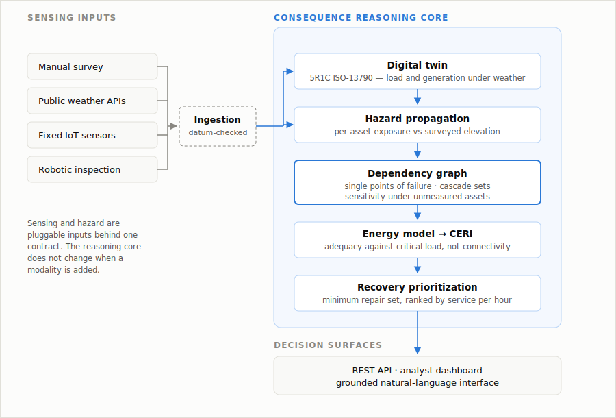
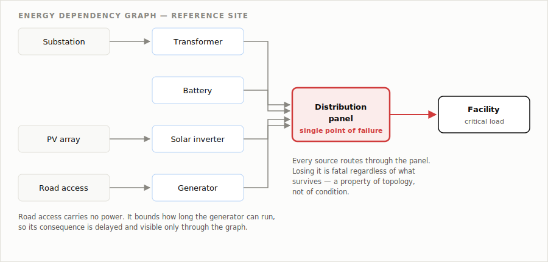
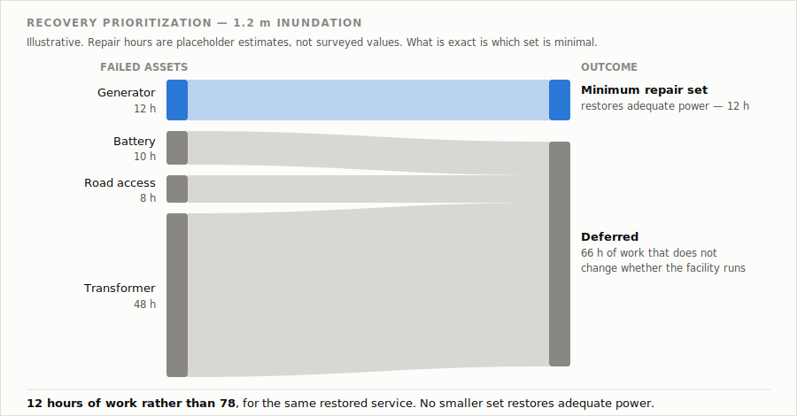
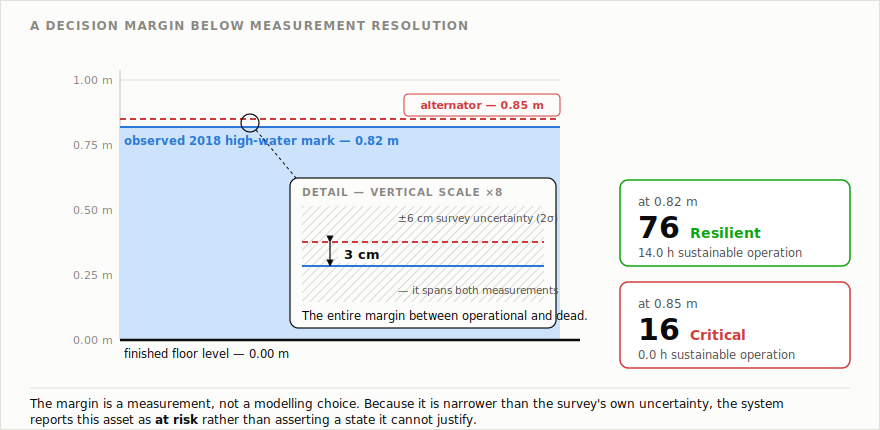

# ResilienceScout

### Decision intelligence for climate-resilient critical infrastructure

> **When climate hazards disable a critical facility, which single intervention restores the most
> service with the least repair effort?**

[]()
[]()
[](LICENSE)

ResilienceScout is a decision-support platform that evaluates the operational readiness of critical
infrastructure — hospitals, schools, emergency shelters, campuses, utilities and public buildings —
under climate hazard.

Instead of only identifying **what is damaged**, it answers the questions a decision-maker actually
has:

- Can the facility still operate?
- How long can it keep operating?
- Which repair restores service fastest?
- Where are the hidden single points of failure?

---

## Why ResilienceScout

Most post-hazard tooling focuses on **damage detection**. ResilienceScout focuses on **damage
consequence** — how failures propagate through a facility's energy infrastructure, and the minimum
set of actions that restores operation.

Critically, restoration is judged on **adequacy, not connectivity**. Under deep inundation a
roof-mounted inverter survives, so a topology check reports the facility as powered while the
energy model reports zero hours of sustainable operation.

---

## System architecture

<p align="center">
  
</p>

Sensing and hazard are pluggable inputs. The reasoning core does not change when a modality is
added — robotic inspection is one sensing modality behind the ingestion contract, not the project.

---

## Key capabilities

**Infrastructure dependency graph.** Models transformers, generators, batteries, switchgear, PV and
critical loads as a directed graph; detects cascading failures and single points of failure that are
invisible to a per-asset checklist.

<p align="center">
  
</p>

**Recovery prioritization.** Searches for the minimum repair set that restores adequate power, and
reports what deferring everything else costs.

<p align="center">
  
</p>

**Climate Energy Readiness Index (CERI).** Four interpretable sub-scores — energy readiness, flood
readiness, backup duration, critical vulnerabilities — read against the *post-hazard* resource set
rather than the nameplate inventory.

**Physics-informed digital twin.** A 5R1C thermal model (ISO 13790) estimates changing building load
under live weather, so sustainable-hours figures aren't a division problem with an invented
numerator.

**Uncertainty-aware reasoning.** Every input is tagged `SOURCED`, `DERIVED`, `REPORTED` or
`PLACEHOLDER`, enforced in code. Where a value is unmeasured, the system prices its absence instead
of assuming it — and reports an asset as *at risk* rather than resolving to a state it cannot
justify.

---

## Prototype finding

At the reference site, operational readiness collapses across **3 cm** of equipment elevation.

| Flood level | CERI | Sustainable operation | Status |
|---|---|---|---|
| 0.82 m | **76** | 14.0 h | Resilient |
| 0.85 m | **16** | 0.0 h | Critical |

The generator alternator sits at 0.85 m; the observed 2018 high-water mark is 0.82 m. That margin is
**narrower than the survey's own uncertainty** (±6 cm at 2σ), so the system reports the asset as
*at risk* rather than asserting a state it cannot justify.

<p align="center">
  
</p>

Raising one equipment plinth by 30 cm moves the facility across the entire band — an intervention no
damage report would surface, because the finding is about a margin *between* assets, not any asset's
condition.

---

## Implementation status

| Component | Status |
|---|---|
| Dependency graph, SPOF detection | Implemented, tested |
| Recovery prioritization | Implemented, tested |
| CERI scoring | Implemented, tested — weights are engineering baselines, uncalibrated |
| Hazard propagation, datum enforcement | Implemented, tested |
| Physics-informed digital twin | Implemented — not yet validated against measured indoor conditions |
| REST API, analyst dashboard | Implemented |
| Provenance tracking | Implemented, enforced in tests |
| Robotic inspection, CV damage detection | In development |
| Multi-site deployment | Architecture supports; awaiting second surveyed site |

80 regression tests, running fully offline with no API keys. **No evaluation results are reported
yet** — see the [evaluation plan](docs/evaluation.md). Population-served and repair-effort figures
are placeholders, so recovery rankings demonstrate a method rather than issuing advice.

---

## Quick start

```bash
git clone https://github.com/bridg3alt/ResilienceScout.git
cd ResilienceScout

python -m venv .venv
.venv\Scripts\activate           # Windows
source .venv/bin/activate        # macOS / Linux

pip install -r requirements.txt

cd backend
uvicorn resilienceos.api:app --reload    # http://localhost:8000/docs
```

```bash
cd dashboard                     # separate terminal
npm install && npm run dev       # http://localhost:5173
```

An optional `GROQ_API_KEY` enables prose responses from the natural-language interface; without one
it returns retrieved evidence and live model output.

```bash
python -m pytest                 # 80 regression tests
```

---

## Repository structure

```text
backend/resilienceos/    reasoning core — dependency graph, recovery, CERI,
                         hazard propagation, twin, energy model, REST API
backend/tests/           regression suite
dashboard/               React analyst interface
docs/                    evaluation plan, deployment guide, figures
```

---

## Technology

**Backend** Python · FastAPI · NumPy · pandas · Pydantic
**Frontend** React · TypeScript · Tailwind · Recharts
**Simulation** `rcbsim` — ISO 13790 5R1C (ETH Zürich, MIT)
**Hazard data** Open-Meteo (keyless)
**Testing** pytest

---

## Documentation

- [Evaluation plan](docs/evaluation.md) — what would count as evidence for the claims here
- [Deploying to another facility](docs/new-facility.md) — what changes per site, what doesn't

---

## Roadmap

- Per-site parameter separation; second surveyed facility on shared upstream infrastructure
- Surveyed repair-effort and population data, replacing placeholders
- Robotic inspection platform feeding the live ingestion contract
- Twin validation against logged indoor conditions
- Multi-hazard support — the graph does not care which hazard removed an asset

---

---

## Acknowledgements

- **Sahrdaya College of Engineering and Technology** — site access and survey support
- **Jayathissa et al.**, *Applied Energy* 202 (2017) — 5R1C implementation (`rcbsim`), ETH Zürich
- **Open-Meteo** — open weather forecast and reanalysis APIs
- **Kerala State Disaster Management Authority** — Minimum Standards of Relief (Ed. 1, 2020), used
  as an area-based upper bound on emergency occupancy

---

## License

MIT — see [LICENSE](LICENSE).

---


